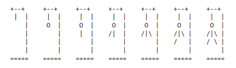

# Hangman_and_Guillotine
"Hangman" and "Guillotine" are classic games in which the player has to guess the letters in a guessed word. For each incorrectly guessed letter, an additional part of the gallows (or guillotine) is drawn, which will gradually be completed if the player fails to guess the word.

In this version of the game, the words to guess are animal names such as RABBIT (rabbit) and PIGEON (pigeon), but you can replace them with your own words.

The variable HANGMAN_PICS contains string values for the ASCII graphics that display each step of the gallows (or guillotine) drawing, creating a visual representation of the process.

Players will have to use their intuition, word knowledge, and logic to guess the word before the entire gallows (or guillotine) is drawn.

## How to Play

1. Run the program in a compatible environment.
2. Guess letters one at a time to unveil the animal name.
3. For each incorrect guess, a piece of the gallows (or guillotine) will be drawn.
4. Uncover the animal name before the visual representation of the gallows (or guillotine) is completed.

## Features

- Immerse yourself in the classic word-guessing game with a creative twist.
- Engage your intuition, vocabulary, and logic to decipher the animal name.
- Experience the suspense as each incorrect guess brings you closer to a visual representation of the gallows (or guillotine).

## Instructions

1. Open a terminal or command prompt.
2. Navigate to the program's directory.
3. Run the program using `python animal_hangman.py`.
4. Guess letters one at a time to reveal the hidden animal name.

## Sample Output

## Note

The Animal Hangman Challenge offers an entertaining and thought-provoking experience. Put your word knowledge and deduction skills to the test as you strive to decipher the animal name before the gallows (or guillotine) is fully drawn.
